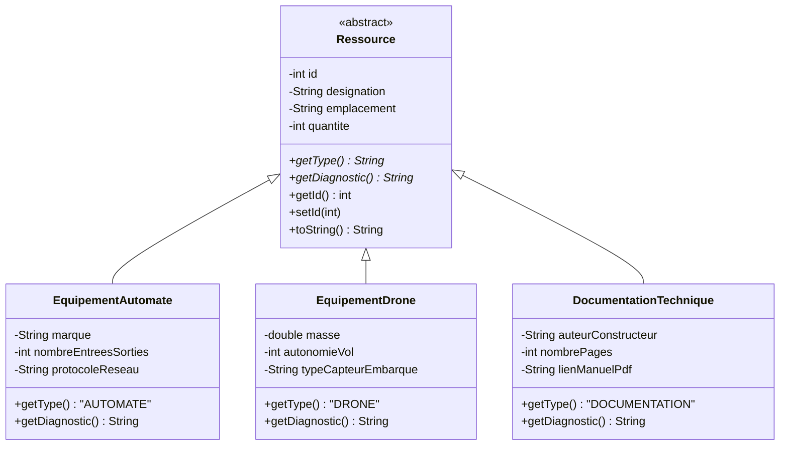
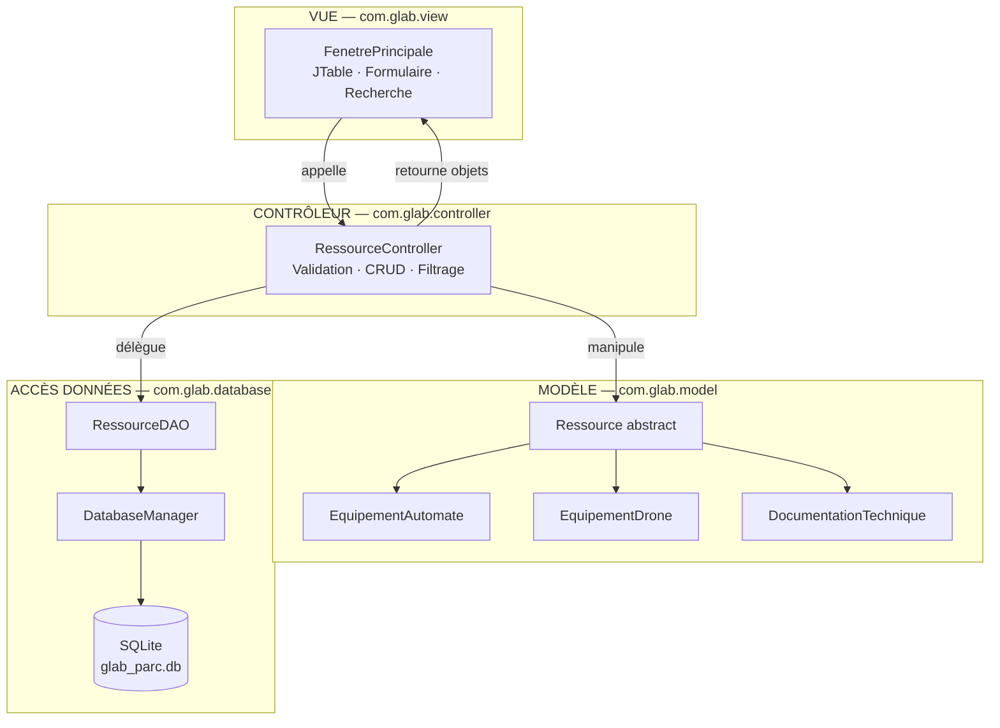
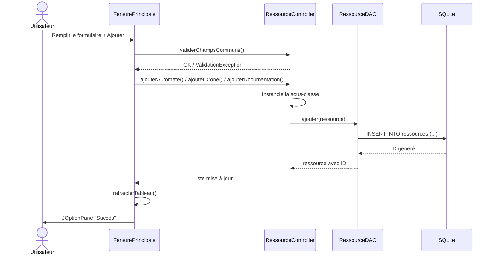

<div align="center">

# Rapport sur la Conception Orientée Objet

## Projet G-Lab
### Gestion du parc de matériel d'un laboratoire technologique

<br>

| | |
|---|---|
| **Réalisé par** | Oussama Ennadafy |
| **Module** | Programmation Orientée Objet — Java |
| **Date** | Juillet 2026 |
| **Technologies** | Java 17 · Swing · JDBC · SQLite · Maven |

<br>

*Projet final — Laboratoire technologique universitaire*

</div>

---

## Table des matières

1. [Résumé exécutif](#1-résumé-exécutif)
2. [Introduction](#2-introduction)
3. [Analyse du domaine](#3-analyse-du-domaine)
4. [Diagrammes UML](#4-diagrammes-uml)
5. [Application des principes POO](#5-application-des-principes-poo)
6. [Architecture MVC](#6-architecture-mvc)
7. [Persistance des données](#7-persistance-des-données)
8. [Patrons de conception et bonnes pratiques](#8-patrons-de-conception-et-bonnes-pratiques)
9. [Flux fonctionnels](#9-flux-fonctionnels)
10. [Fonctionnalités de l'application](#10-fonctionnalités-de-lapplication)
11. [Structure du code source](#11-structure-du-code-source)
12. [Technologies et environnement](#12-technologies-et-environnement)
13. [Tests et validation](#13-tests-et-validation)
14. [Perspectives d'évolution](#14-perspectives-dévolution)
15. [Conclusion](#15-conclusion)
16. [Annexes](#16-annexes)

---

## 1. Résumé exécutif

Ce rapport présente la conception orientée objet de **G-Lab**, une application Java de bureau destinée à la gestion centralisée du stock de matériel d'un laboratoire technologique universitaire.

L'application modélise trois types de ressources — automates industriels, drones embarqués et documentation technique — au sein d'une **hiérarchie de classes** fondée sur une classe abstraite `Ressource`. Les quatre piliers de la POO (abstraction, encapsulation, héritage, polymorphisme) sont appliqués de manière cohérente à travers l'ensemble du projet.

L'architecture **MVC** (Modèle-Vue-Contrôleur) assure une séparation nette des responsabilités : le modèle reste indépendant de l'interface, le contrôleur centralise la logique métier et la validation, et la couche DAO gère la persistance JDBC vers une base SQLite locale.

**Résultats obtenus :**
- 10 fichiers Java structurés en 5 packages (~1 200 lignes de code)
- Interface Swing ergonomique avec formulaire adaptatif et filtrage temps réel
- Persistance fiable avec `PreparedStatement` et try-with-resources
- JAR exécutable autonome généré via Maven Shade Plugin

---

## 2. Introduction

### 2.1 Contexte

Le laboratoire technologique universitaire **G-Lab** dispose d'un parc matériel hétérogène comprenant :

- des **automates industriels** (Modbus, Profinet, EtherCAT),
- des **drones embarqués** équipés de capteurs,
- de la **documentation technique** (manuels constructeur, guides PDF).

La gestion manuelle de ce stock — via tableurs ou registres papier — engendre des **erreurs de saisie**, une **absence de traçabilité** et une **perte de temps** pour le personnel du laboratoire.

### 2.2 Problématique

Comment concevoir une application logicielle qui :

1. Modélise fidèlement la diversité des ressources du laboratoire ?
2. Applique rigoureusement les principes de la programmation orientée objet ?
3. Offre une interface ergonomique et des fonctionnalités de recherche ?
4. Garantit la persistance et l'intégrité des données ?

### 2.3 Solution proposée

**G-Lab** est une application Java desktop développée selon l'architecture MVC. Elle propose une interface Swing intuitive permettant de consulter, ajouter, filtrer et supprimer des ressources, avec sauvegarde automatique en base SQLite.

### 2.4 Objectifs

| # | Objectif | Indicateur de réussite |
|---|----------|----------------------|
| 1 | Modéliser les ressources par une hiérarchie POO | Classe abstraite + 3 sous-classes concrètes |
| 2 | Appliquer les 4 piliers de la POO | Abstraction, encapsulation, héritage, polymorphisme documentés et implémentés |
| 3 | Séparer vue, logique et persistance | Architecture MVC en packages distincts |
| 4 | Valider les saisies utilisateur | Messages d'erreur explicites via `JOptionPane` |
| 5 | Persister les données de manière fiable | CRUD JDBC complet avec SQLite |

---

## 3. Analyse du domaine

### 3.1 Identification des entités

| Entité | Type | Description | Attributs communs | Attributs spécifiques |
|--------|------|-------------|-------------------|----------------------|
| `Ressource` | Abstraite | Tout élément du stock du laboratoire | id, désignation, emplacement, quantité | — |
| `EquipementAutomate` | Concrète | Automate industriel programmable | (hérités) | marque, nombre E/S, protocole réseau |
| `EquipementDrone` | Concrète | Drone avec capteurs embarqués | (hérités) | masse (kg), autonomie (min), type de capteur |
| `DocumentationTechnique` | Concrète | Manuels et guides constructeur | (hérités) | auteur/constructeur, nombre de pages, lien PDF |

### 3.2 Règles métier

- Chaque ressource possède une **désignation unique** et un **emplacement** obligatoires.
- La **quantité** est un entier positif ou nul.
- Les attributs spécifiques sont **obligatoires** selon le type sélectionné.
- La suppression d'une ressource nécessite une **confirmation explicite** de l'utilisateur.
- Le **diagnostic** affiché dans le tableau varie selon le type (polymorphisme).

### 3.3 Relations entre entités



---

## 4. Diagrammes UML

### 4.1 Diagramme de classes — Modèle

```
┌──────────────────────────────────────────────┐
│            <<abstract>> Ressource            │
├──────────────────────────────────────────────┤
│ - id : int                                   │
│ - designation : String                       │
│ - emplacement : String                       │
│ - quantite : int                             │
├──────────────────────────────────────────────┤
│ + getType() : String              abstract   │
│ + getDiagnostic() : String        abstract   │
│ + getId() / setId(int)                       │
│ + getDesignation() / setDesignation(String)  │
│ + getEmplacement() / setEmplacement(String)  │
│ + getQuantite() / setQuantite(int)           │
│ + toString() : String                        │
└────────────────────┬─────────────────────────┘
                     │ extends
       ┌─────────────┼─────────────┐
       ▼             ▼             ▼
┌─────────────┐ ┌─────────────┐ ┌──────────────────────┐
│ Equipement  │ │ Equipement  │ │ Documentation        │
│ Automate    │ │ Drone       │ │ Technique            │
├─────────────┤ ├─────────────┤ ├──────────────────────┤
│ - marque    │ │ - masse     │ │ - auteurConstructeur │
│ - nbES      │ │ - autonomie │ │ - nombrePages        │
│ - protocole │ │ - capteur   │ │ - lienManuelPdf      │
├─────────────┤ ├─────────────┤ ├──────────────────────┤
│ +getType()  │ │ +getType()  │ │ +getType()           │
│ +getDiag()  │ │ +getDiag()  │ │ +getDiag()           │
└─────────────┘ └─────────────┘ └──────────────────────┘
```

### 4.2 Diagramme d'architecture MVC



### 4.3 Diagramme de séquence — Ajout d'une ressource



---

## 5. Application des principes POO

### 5.1 Abstraction

La classe `Ressource` est déclarée **abstraite** : elle ne peut pas être instanciée directement. Elle définit le **contrat** que toute ressource du laboratoire doit respecter.

| Méthode abstraite | Rôle | Exemple de retour |
|-------------------|------|-------------------|
| `getType()` | Identifie le type métier | `"AUTOMATE"`, `"DRONE"`, `"DOCUMENTATION"` |
| `getDiagnostic()` | Produit un résumé technique contextualisé | `"Marque: Siemens \| E/S: 16 \| Protocole: Modbus"` |

**Bénéfice :** le tableau, le contrôleur et la DAO manipulent des objets `Ressource` sans connaître le type concret — ce qui constitue le fondement du polymorphisme.

### 5.2 Encapsulation

Tous les attributs sont déclarés **`private`**. L'accès externe passe exclusivement par des accesseurs et mutateurs publics :

```java
// Ressource.java
private int quantite;

public int getQuantite() {
    return quantite;
}

public void setQuantite(int quantite) {
    this.quantite = quantite;
}
```

La **validation des saisies** est centralisée dans `RessourceController` (et non dans la vue ni le modèle), conformément au principe de responsabilité unique :

```java
public void validerChampsCommuns(String designation, String emplacement, String quantiteTexte)
        throws ValidationException {
    if (designation == null || designation.isBlank()) {
        throw new ValidationException("La désignation est obligatoire.");
    }
    // ...
}
```

### 5.3 Héritage

| Classe fille | Classe mère | Attributs ajoutés | Constructeur |
|--------------|-------------|-------------------|--------------|
| `EquipementAutomate` | `Ressource` | marque, nombreEntreesSorties, protocoleReseau | `super(designation, emplacement, quantite)` |
| `EquipementDrone` | `Ressource` | masse, autonomieVol, typeCapteurEmbarque | `super(designation, emplacement, quantite)` |
| `DocumentationTechnique` | `Ressource` | auteurConstructeur, nombrePages, lienManuelPdf | `super(designation, emplacement, quantite)` |

Chaque sous-classe **réutilise** les attributs communs via `super(...)` et **étend** le comportement en redéfinissant `getType()` et `getDiagnostic()`.

### 5.4 Polymorphisme

Le polymorphisme est exploité à **trois niveaux** dans l'application :

#### Niveau 1 — Affichage (Vue)

```java
// FenetrePrincipale.java — rafraichirTableau()
for (Ressource ressource : ressources) {
    modeleTableau.addRow(new Object[]{
        ressource.getId(),
        ressource.getType(),
        ressource.getDesignation(),
        ressource.getEmplacement(),
        ressource.getQuantite(),
        ressource.getDiagnostic()   // ← comportement polymorphe
    });
}
```

#### Niveau 2 — Sérialisation (DAO)

```java
// RessourceDAO.java — remplirPreparedStatement()
if (ressource instanceof EquipementAutomate automate) {
    pstmt.setString(5, automate.getMarque());
    pstmt.setString(6, String.valueOf(automate.getNombreEntreesSorties()));
    pstmt.setString(7, automate.getProtocoleReseau());
} else if (ressource instanceof EquipementDrone drone) {
    // ...
}
```

#### Niveau 3 — Reconstruction (DAO)

```java
// RessourceDAO.java — construireRessource()
return switch (type) {
    case "DRONE"         -> new EquipementDrone(id, designation, emplacement, quantite, ...);
    case "AUTOMATE"      -> new EquipementAutomate(id, designation, emplacement, quantite, ...);
    case "DOCUMENTATION" -> new DocumentationTechnique(id, designation, emplacement, quantite, ...);
    default              -> throw new SQLException("Type de ressource inconnu : " + type);
};
```

---

## 6. Architecture MVC

### 6.1 Vue d'ensemble

| Couche | Package | Classe(s) | Responsabilité | Dépend de |
|--------|---------|-----------|----------------|-----------|
| **Modèle** | `com.glab.model` | `Ressource` + 3 sous-classes | Représentation objet des données métier | — |
| **Vue** | `com.glab.view` | `FenetrePrincipale` | Affichage, interactions utilisateur | Contrôleur |
| **Contrôleur** | `com.glab.controller` | `RessourceController` | Logique métier, validation, orchestration | Modèle, DAO |
| **DAO** | `com.glab.database` | `RessourceDAO`, `DatabaseManager` | Persistance JDBC | Modèle |

### 6.2 Modèle — `com.glab.model`

Le modèle est **purement métier** : aucune dépendance vers Swing, JDBC ou tout autre framework. Il peut être réutilisé tel quel dans une application web, un service REST ou des tests unitaires.

### 6.3 Vue — `com.glab.view`

`FenetrePrincipale` gère exclusivement l'interface utilisateur :

| Composant Swing | Rôle |
|-----------------|------|
| `JTable` + `DefaultTableModel` | Affichage tabulaire du stock |
| `TableRowSorter` + `RowFilter` | Tri et filtrage en temps réel |
| `JComboBox` | Sélection du type de ressource |
| `GridBagLayout` | Formulaire adaptatif |
| `JOptionPane` | Messages succès / erreur / confirmation |

**Règle respectée :** la vue ne contient **aucune logique métier** et n'accède **jamais** directement à la DAO.

### 6.4 Contrôleur — `com.glab.controller`

`RessourceController` centralise :

- le **chargement** des ressources depuis la DAO,
- le **filtrage** en mémoire par critère de recherche,
- l'**ajout** typé (`ajouterAutomate`, `ajouterDrone`, `ajouterDocumentation`),
- la **suppression** avec synchronisation mémoire/base,
- la **validation** via `ValidationException` (classe interne statique).

### 6.5 Point d'entrée — `GLabApp`

```java
public static void main(String[] args) {
    DatabaseManager.initialiserBase();
    UIManager.setLookAndFeel(UIManager.getSystemLookAndFeelClassName());
    EventQueue.invokeLater(() -> {
        RessourceController controller = new RessourceController();
        new FenetrePrincipale(controller).setVisible(true);
    });
}
```

---

## 7. Persistance des données

### 7.1 Choix technologique

**SQLite** a été retenu pour sa simplicité de déploiement : base de données embarquée dans un fichier local (`glab_parc.db`), sans serveur à installer, créée automatiquement au premier lancement.

### 7.2 Schéma relationnel

**Table `ressources` :**

| Colonne | Type SQLite | Contrainte | Description |
|---------|-------------|------------|-------------|
| `id` | INTEGER | PRIMARY KEY AUTOINCREMENT | Identifiant unique |
| `type` | TEXT | NOT NULL | `AUTOMATE` / `DRONE` / `DOCUMENTATION` |
| `designation` | TEXT | NOT NULL | Nom de la ressource |
| `emplacement` | TEXT | NOT NULL | Localisation dans le laboratoire |
| `quantite` | INTEGER | NOT NULL | Nombre d'unités en stock |
| `attribut_specifique1` | TEXT | — | 1er attribut spécifique au type |
| `attribut_specifique2` | TEXT | — | 2e attribut spécifique au type |
| `attribut_specifique3` | TEXT | — | 3e attribut spécifique au type |

### 7.3 Mapping objet-relationnel

| Type objet | spec1 | spec2 | spec3 |
|------------|-------|-------|-------|
| `EquipementAutomate` | marque | nombre E/S | protocole réseau |
| `EquipementDrone` | type capteur | autonomie (min) | masse (kg) |
| `DocumentationTechnique` | auteur/constructeur | nombre de pages | lien PDF |

### 7.4 Sécurité et robustesse

| Pratique | Implémentation |
|----------|----------------|
| Injection SQL | `PreparedStatement` avec paramètres liés (`?`) |
| Fuites de ressources | `try-with-resources` sur Connection, Statement, ResultSet |
| Gestion d'erreurs | `RuntimeException` encapsulant `SQLException` dans la DAO |
| Validation utilisateur | `ValidationException` dans le contrôleur, affichée par la vue |

---

## 8. Patrons de conception et bonnes pratiques

| Patron / Pratique | Description | Implémentation G-Lab |
|-------------------|-------------|---------------------|
| **MVC** | Séparation Modèle-Vue-Contrôleur | 4 packages distincts : `model`, `view`, `controller`, `database` |
| **DAO** | Data Access Object | `RessourceDAO` isole tout accès JDBC |
| **Factory implicite** | Création d'objets selon un critère | `construireRessource()` dans la DAO |
| **Template Method** | Squelette dans la classe mère, détails dans les filles | `getType()` et `getDiagnostic()` abstraits dans `Ressource` |
| **Exception métier** | Erreurs de validation utilisateur | `RessourceController.ValidationException` |
| **Singleton utilitaire** | Classe non instanciable | `DatabaseManager` avec constructeur privé |
| **Delegation** | La vue délègue au contrôleur | Aucun accès direct Vue → DAO |

---

## 9. Flux fonctionnels

### 9.1 Ajout d'une ressource

| Étape | Acteur | Action |
|-------|--------|--------|
| 1 | Utilisateur | Remplit le formulaire et clique sur **Ajouter** |
| 2 | Vue | Appelle `controller.validerChampsCommuns()` puis les validateurs spécifiques |
| 3 | Contrôleur | Instancie la sous-classe appropriée (`EquipementAutomate`, etc.) |
| 4 | DAO | Exécute `INSERT` avec `PreparedStatement`, récupère l'ID généré |
| 5 | Vue | Rafraîchit le tableau, vide le formulaire, affiche un message de succès |

### 9.2 Filtrage en temps réel

| Étape | Acteur | Action |
|-------|--------|--------|
| 1 | Utilisateur | Saisit un critère dans le champ de recherche |
| 2 | Vue | `DocumentListener` déclenche `appliquerFiltre()` |
| 3 | Vue | `TableRowSorter` applique un `RowFilter.regexFilter` sur les colonnes 1, 2, 3 |

### 9.3 Suppression d'une ressource

| Étape | Acteur | Action |
|-------|--------|--------|
| 1 | Utilisateur | Sélectionne une ligne, clique sur **Supprimer la sélection** |
| 2 | Vue | Affiche `JOptionPane.showConfirmDialog` |
| 3 | Contrôleur | Appelle `dao.supprimer(id)` et retire l'objet de la liste en mémoire |
| 4 | Vue | Rafraîchit le tableau |

---

## 10. Fonctionnalités de l'application

| Fonctionnalité | Description technique | Composant |
|----------------|----------------------|-----------|
| **Tableau dynamique** | Affichage de tout le stock avec colonne Diagnostic polymorphe | `JTable` + `DefaultTableModel` |
| **Formulaire adaptatif** | Champs spécifiques activés/désactivés selon le type | `JComboBox` + `adapterChampsSpecifiques()` |
| **Recherche temps réel** | Filtrage instantané sans requête base | `TableRowSorter` + `RowFilter` |
| **Validation des saisies** | Contrôles de type, bornes, champs obligatoires | `RessourceController.ValidationException` |
| **Ajout de ressource** | Création polymorphe + persistance | Contrôleur → DAO → SQLite |
| **Suppression sécurisée** | Confirmation obligatoire avant suppression | `JOptionPane.YES_NO_OPTION` |
| **Rafraîchissement** | Rechargement depuis la base | `controller.chargerRessources()` |

---

## 11. Structure du code source

```
com.glab/
├── GLabApp.java                     Point d'entrée — initialisation et lancement
│
├── model/                           COUCHE MODÈLE (POO)
│   ├── Ressource.java               Classe abstraite — socle commun
│   ├── EquipementAutomate.java      Sous-classe : automates industriels
│   ├── EquipementDrone.java         Sous-classe : drones embarqués
│   └── DocumentationTechnique.java  Sous-classe : documentation technique
│
├── controller/                      COUCHE CONTRÔLEUR
│   └── RessourceController.java     Validation, CRUD, filtrage
│
├── database/                        COUCHE PERSISTANCE
│   ├── DatabaseManager.java         Connexion SQLite, schéma
│   └── RessourceDAO.java            CRUD polymorphe JDBC
│
└── view/                            COUCHE VUE
    └── FenetrePrincipale.java       Interface Swing complète
```

**Métriques du projet :**

| Métrique | Valeur |
|----------|--------|
| Fichiers Java | 10 |
| Packages | 5 |
| Classes | 9 (+ 1 classe interne `ValidationException`) |
| Lignes de code (approx.) | ~1 200 |
| Dépendances externes | 3 (sqlite-jdbc, slf4j-api, slf4j-simple) |

---

## 12. Technologies et environnement

| Technologie | Version | Rôle dans le projet |
|-------------|---------|---------------------|
| **Java** | 17 (LTS) | Langage principal — switch expressions, pattern matching `instanceof`, text blocks |
| **Swing** | JDK intégré | Interface graphique desktop (JFrame, JTable, JOptionPane) |
| **JDBC** | JDK intégré | API d'accès à la base de données |
| **SQLite** | 3.45.1.0 | Base de données embarquée locale |
| **Maven** | 3.6+ | Gestion des dépendances, compilation, packaging JAR |
| **SLF4J** | 2.0.12 | Journalisation (dépendance requise par sqlite-jdbc) |

### Commandes de build et exécution

```bash
mvn compile                              # Compiler le projet
mvn exec:java                            # Lancer l'application
mvn package                              # Créer le JAR exécutable
java -jar target/g-lab-1.0.0.jar         # Exécuter le JAR
bash run.sh                              # Script alternatif (sans Maven)
```

---

## 13. Tests et validation

### 13.1 Validation fonctionnelle

| Scénario | Résultat attendu | Statut |
|----------|-------------------|--------|
| Lancement de l'application | Fenêtre affichée, base initialisée | ✔ Validé |
| Ajout d'un automate | Ressource enregistrée, tableau mis à jour | ✔ Validé |
| Ajout d'un drone | Attributs spécifiques persistés correctement | ✔ Validé |
| Ajout d'une documentation | Lien PDF et auteur enregistrés | ✔ Validé |
| Champ obligatoire vide | Message d'erreur JOptionPane | ✔ Validé |
| Quantité négative | Message « ne peut pas être négative » | ✔ Validé |
| Filtrage temps réel | Tableau filtré instantanément | ✔ Validé |
| Suppression avec confirmation | Ressource retirée de la base et du tableau | ✔ Validé |
| Persistance après redémarrage | Données rechargées depuis SQLite | ✔ Validé |

### 13.2 Validation de la conception POO

| Principe | Vérification | Statut |
|----------|-------------|--------|
| Abstraction | `Ressource` ne peut pas être instanciée | ✔ |
| Encapsulation | Tous les attributs sont `private` | ✔ |
| Héritage | 3 sous-classes avec `extends Ressource` | ✔ |
| Polymorphisme | `getDiagnostic()` retourne un texte différent par type | ✔ |
| MVC | Aucun import Swing dans `model/` ni `database/` | ✔ |

---

## 14. Perspectives d'évolution

| Évolution | Description | Impact sur la conception |
|-----------|-------------|-------------------------|
| **Nouveaux types** | Capteurs IoT, imprimantes 3D, oscilloscopes | +1 sous-classe de `Ressource`, extension DAO et formulaire |
| **Modification en ligne** | Édition d'une ressource existante | Méthode `mettreAJour()` déjà présente dans la DAO |
| **Export de données** | Export PDF/Excel du stock | Nouveau service utilisant le contrôleur existant |
| **Base distante** | Migration vers PostgreSQL | Changer l'URL JDBC dans `DatabaseManager` |
| **Interface web** | Application Spring Boot + REST | Réutilisation du modèle et du contrôleur |
| **Authentification** | Gestion des rôles (admin, technicien) | Nouveau package `security/` sans modifier le modèle |

---

## 15. Conclusion

Le projet **G-Lab**, réalisé par **Oussama Ennadafy**, constitue une démonstration concrète et complète des principes fondamentaux de la programmation orientée objet appliqués à un cas métier réel.

**Ce qui a été démontré :**

- **L'abstraction** unifie des entités hétérogènes sous un contrat commun (`Ressource`).
- **L'héritage** structure la hiérarchie métier et élimine la duplication de code.
- **Le polymorphisme** permet un traitement uniforme dans l'interface, le contrôleur et la persistance.
- **L'encapsulation** protège l'intégrité des données et isole les responsabilités.
- **L'architecture MVC** garantit un code maintenable, testable et évolutif.

La conception adoptée facilite l'extension future du système : l'ajout d'un nouveau type de ressource ne nécessite qu'une sous-classe, une extension du mapping DAO et un enrichissement du formulaire adaptatif — sans modification de l'architecture existante.

---

## 16. Annexes

### Annexe A — Extrait de la classe abstraite `Ressource`

```java
public abstract class Ressource {
    private int id;
    private String designation;
    private String emplacement;
    private int quantite;

    public abstract String getType();
    public abstract String getDiagnostic();

    // Constructeurs, accesseurs, mutateurs, toString()...
}
```

### Annexe B — Exemple de diagnostic polymorphe

| Type | Appel `getDiagnostic()` | Résultat |
|------|------------------------|----------|
| AUTOMATE | `automate.getDiagnostic()` | `Marque: Siemens \| E/S: 16 \| Protocole: Modbus` |
| DRONE | `drone.getDiagnostic()` | `Masse: 1.25 kg \| Autonomie: 30 min \| Capteur: LIDAR` |
| DOCUMENTATION | `doc.getDiagnostic()` | `Auteur: Schneider \| Pages: 248 \| Manuel: manual.pdf` |

### Annexe C — Arborescence complète du projet

```
Projet final G-Lab/
├── pom.xml
├── run.sh
├── README.md
├── src/main/java/com/glab/     (10 fichiers Java)
├── lib/                        (dépendances JDBC)
├── target/                     (fichiers compilés)
└── livrables/
    ├── Rapport_Conception_OO.md / .pdf
    ├── Structure_Code_Source.md / .pdf
    ├── Presentation_G-Lab.pptx
    └── G-Lab_Code_Source.zip
```

---

<div align="center">

**Oussama Ennadafy**  
*Projet G-Lab — Juillet 2026*

*Fin du rapport*

</div>
